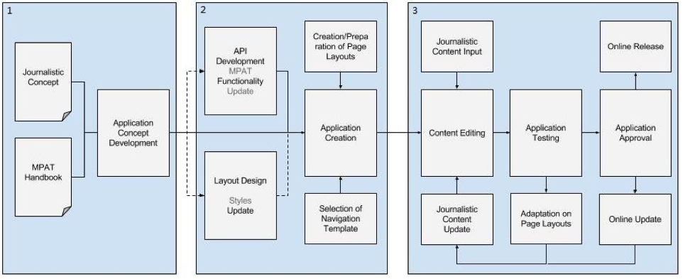
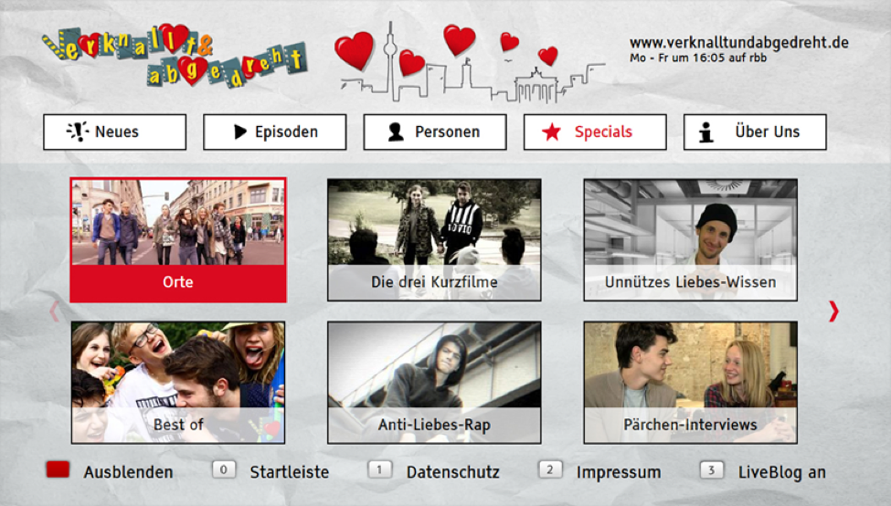
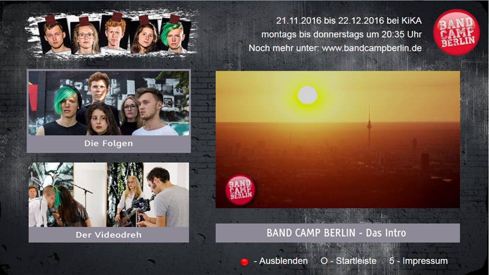
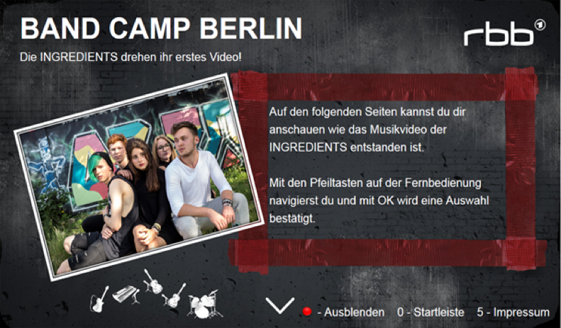
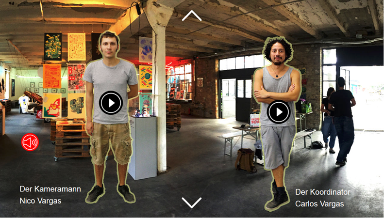

# General Information

This manual outlines and explains how to use the Multiplatform Application Toolkit: MPAT. 

MPAT is a WordPress-based authoring toolkit that allows easy creation and development of interactive applications for HbbTV. 

MPAT implements **HbbTV standards v1.0, v1.5,** and **v2.0** and supports the standard HbbTV **screen size of 1280x720 px**. 

## Browser Preview

Applications built with MPAT can either be viewed on a Smart TV that supports the HbbTV standard versions named above or, alternatively, MPAT can be previewed on the Internet browser with Firefox add-on [FireHbbTV](https://addons.mozilla.org/fr/firefox/addon/firehbbtv/)
 or with the Chrome extension [ChromeHybridTvViewer](https://github.com/karl-rousseau/ChromeHybridTvViewer).

## Application Types // Navigation Models

MPAT supports different application designs: Classical [Website](https://github.com/MPAT-eu/handbook/blob/master/01_general_information.md#website) features interlinked 
hierarchies of MPAT pages similar to classical websites. [SlideFlow](https://github.com/MPAT-eu/handbook/blob/master/01_general_information.md#slideflow) features a story-driven 
structure that follows one specific direction, promotes large imagery and video content similar to the Web-documentary style *PageFlow*. 
MPAT also supports [TimeLine](https://github.com/MPAT-eu/handbook/blob/master/01_general_information.md#timeline)-oriented applications: the idea is that pages can be displayed along a video time line, one at a time.

## Content Components

In addition to the general design of the application structure and layout, MPAT features a variety of **content components** like image, video, audio, text as well as a variety of **interactive elements** like hots spots, links, and menus among others.

## The MPAT Workflow

MPAT is a tool for journalists and editors. Therefore, the initial idea when conceiving the authoring tool was to split the application development process into three steps, illustrated below:

*Figure*: General workflow for developing an MPAT Application in a journalistic context

1. The journalist develops a concept for a story. This concept serves as a basis for an HbbTV application concept. The application concept is bound to the feature set of the MPAT editor, illustrated by the *MPAT Handbook*, and can be conceived together with an MPAT application creator. In other words, based on the journalistic concept and with the help of an MPAT Handbook (which describes features and development workflows), journalists and application creators develop a concept for an interactive HbbTV application.

2. In a second step, the application creator picks up on the developed concept and turns it into a generic and empty (with no content) MPAT application, an **application model** , which can be re-used for different stories. Therefore, the application creator:
	+ chooses a **navigation model**  (Website or SlideFlow or TimeLine)
	+ creates a **page layout** for each page of the application.

	The page layout is an arrangement of content components per page. Content components can be populated with actual content data like video, audio, text, menus, etc.
(Side note: The creation of the application model may result in the development of new graphical layouts, technical modules or APIs that allow incorporating external sources in order to enable all envisaged features and functions.)

3. Step 3 describes the final step in the application creation process: The previously created application model is populated with actual content data. This involves creating, uploading and updating content data as well as testing, previewing, approving and publishing the actual HbbTV application.

For details check the description of [MPAT Editing](https://mpat-eu.github.io/handbook/05_mpat_editing.html).

## Application Design & Navigation Models

The design of HbbTV applications with MPAT is closely related to the selected navigation 
model. The current version of MPAT enables three different navigation 
models: **Website**, **SlideFlow** and **Timeline**.

### Website

The original idea was to use MPAT to create *simple* pages that look like traditional websites. The Navigation Model is based on buttons, clickable tiles or an overall menu. Clicking on either will lead to another page. The Navigation Model *Website* allows a flexible arrangement of pages and supports user-defined navigation.

*Figure* Traditional website design for an HbbTV application - taken from RBB's HbbTV app *verknallt &amp; abgedreht* (November 2015)

*Figure:* Simple website navigation: image tiles lead to linked pages - example from RBB's first pilot application built with MPAT: Band Camp Berlin (2016)

### SlideFlow

SlideFlow is the MPAT term for a very visual, very simple navigation style which resembles PowerPoint™ presentations to a large extent: full screen images, little text, occasionally interaction components or videos embedded (see screenshots below). This Navigation Model is based on the popular web format Pageflow ([http://pageflow.io](http://pageflow.io)). SlideFlow is story-based and restricts the navigation to one-directional movement in order to support the consecutive flow of pages to tell a story.

Visitors navigate this application with the **Arrow Up**/**Arrow Down** buttons on the Remote Control. Videos or interactive components are activated with the **OK** button and if there are more than one such component on a SlideFlow page, they have to be arranged side by side rather than above each other (see Figure 6), because Arrow Up/Arrow Down are reserved for navigating between pages.

*Figure:* SlideFlow page - taken from the first RBB pilot *Band Camp Berlin*

*Figure:* SlideFlow page with Audio and Video Hotspots - taken from the first RBB pilot *Band Camp Berlin* (2016)

### TimeLine

TimeLine is a navigation model with a time line, along which pages can be displayed, one at a time. These pages (with transparent background, otherwise it makes little sense) can be displayed on top of the broadcast video or on top of an on-demand video. Their appearing or disappearing can be triggered by different sorts of events:
                               
* a DVB StreamEvent (if the application uses the broadcast video)
* the current time of the on-demand video (if an on-demand video is used)
* the time since the HbbTV application started
* the wallclock time
* a key stroke on the remote control
