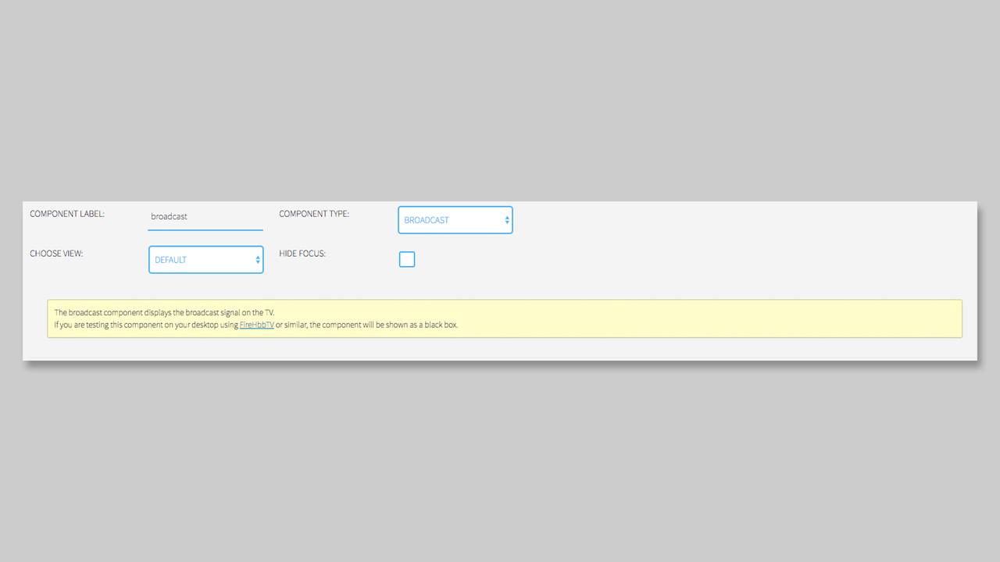

## Broadcast Component

### General

The **Broadcast Component** shows your current broadcast stream. You can use this Component to display the broadcast in a smaller area of your application. If you want to have the Broadcast running in the background, you don't need to use this component. Just leave the background empty on the page and the broadcast will be displayed. 

Please notice, that you can only display **one** broadcast or video component on a `Page` for HbbTV 1.0 and HbbTV 1.5 applications.

### Settings

The **Broadcast Component** is the only component that does not have any settings to setup. Here you only have to select the **Broadcast Component** from the dropdown and it will be displayed in your selected box. Just keep in mind that the stream will not be may show with black bars in the box, because it is may not in a 16:9 format. 

