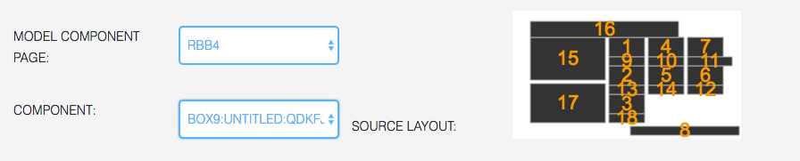

## Clone Component

### General

The **Clone Component** displays a copy of a model component from another page. The copy is live, in
the sense that the clone changes as soon as the model component changes. Any component but a clone 
can be a model.

When a component is a model for one or more clones, the Page Editor refuses to edit it, unless you
check the box **Edit Anyway**.

### Settings

To configure a clone component, first choose the page of the model in the first selector on the left.
Then, the layout with box indexes appears on the right, to help you choose the cloned box. In the 
second selector, a list appears with **box_name:state_name:component_name**

As soon as the component is chosen, the preview shows the clone.