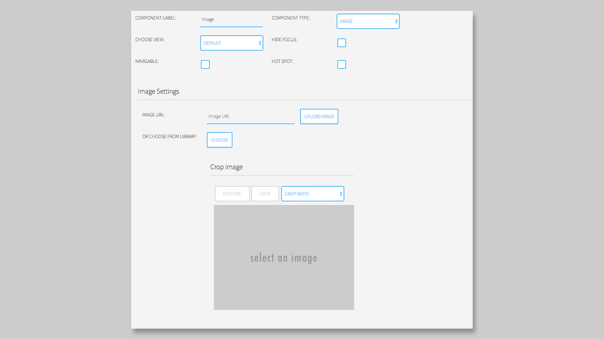
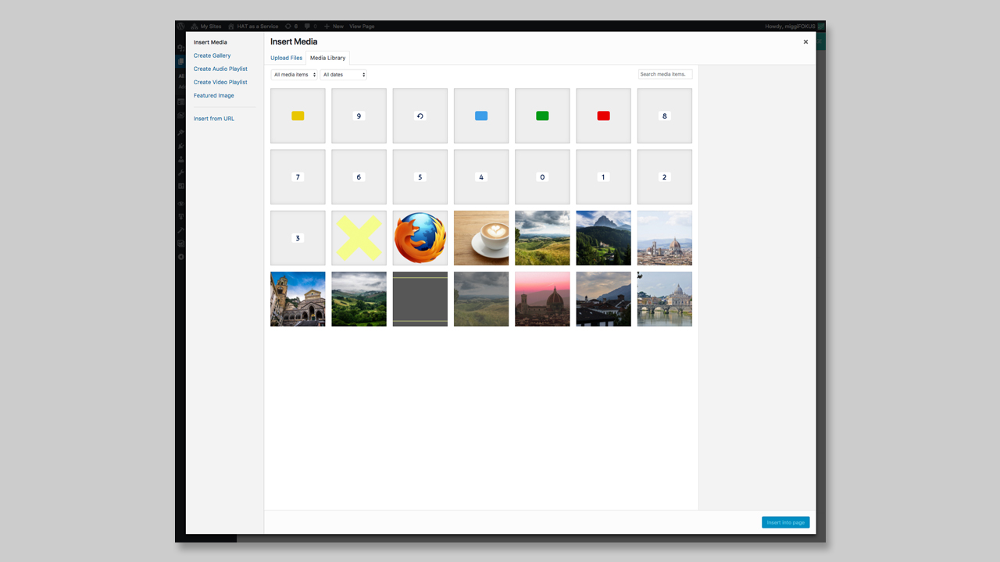

## Image Component

### General

You can use the **Image Component** to display **one** specific image in your application. You do not have a limit, how often you want to use the **Image Component** on a `Page`.   

### Settings

When you choose the Image competent you will find two options:

1. Use an image via URL (or upload an image)
2. Choose the image from the Media Library

The upload functionality will be coming soon.

The use an image from a URL you only have to copy & paste the URL into the text field. 

**NOTICE**: If you decide to add an image via URL the image will not be cropped into the right format of your box! May some parts of the image will be not displayed then.  

We also recommend to upload the image you want to use in your application directly into the media library of WordPress.

To use an image from your Media Library you have to click on the **CHOOSE** button. After clicking on the button, the Media Library will open in a popup.  

Now you can choose the image you want to add. The selected image will be highlighted and now you can click on the button **Insert into page**, to add it to your box. 

Now the image is added to your box, the URL is displayed into the Image URL section, and you can start to crop your image, if you want to.

The size of the light area over the image in the cropping section is the format of your box. You can scale this light area and click on **CROP** to crop the image. Also by clicking on **RESTORE** the image will be displayed in the original format. 

You will also notice a dropdown next to the **CROP** button. Here you have different options, how you want to crop your image:

1. CROP RATIO
2. 16:9
3. 4:3
4. 3:2
5. 3:4
6. 2:3
7. Free

Now you only have to click on **SAVE PAGE** on the right top and your image settings will be saved.
