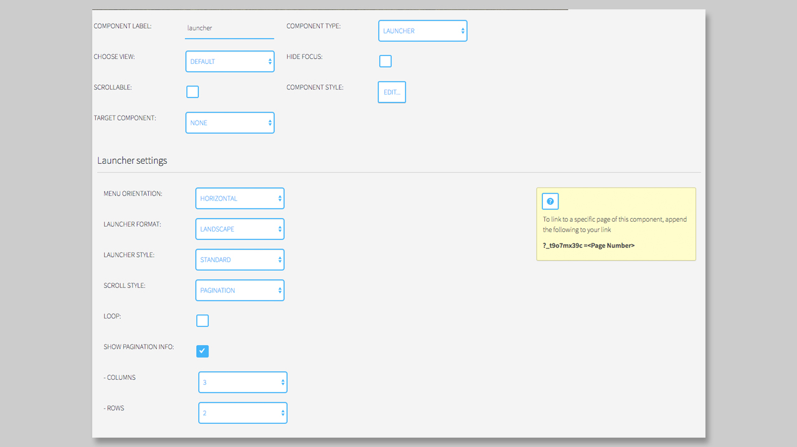
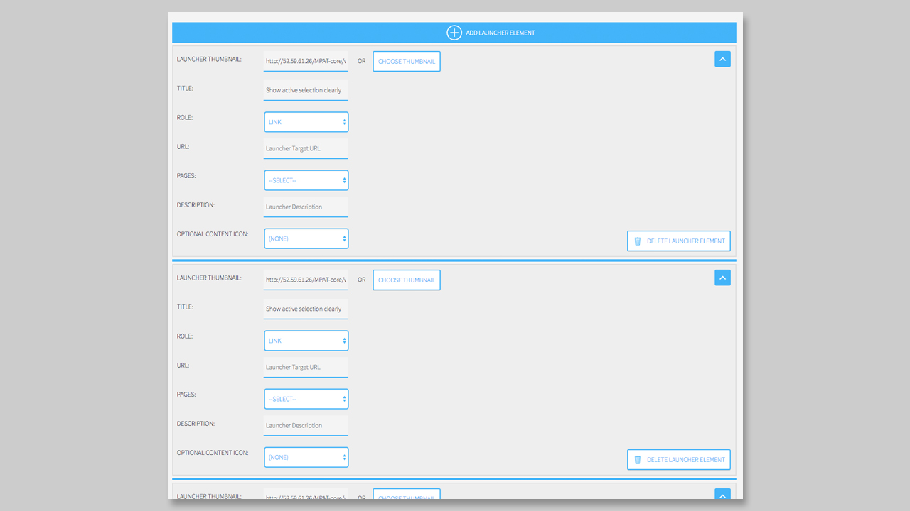

## Launcher Component

### General

The **Launcher Component** is the most complex component of the `MPAT-core`. With the launcher component, you can build a classical launcher, like the **Startleiste** of **rbb** by using the carousel option, or build a matrix of elements using the pagination option.

### Settings

The Settings of the launcher first seams a little bit complicated, but with this description, we will help you to generate and use the **Launcher Component** in a perfect way. 

First, we have to decide the `orientation` of the launcher. Here you can decide between horizontal and vertical. This option is necessary for the scroll style, especially if you take the carousel version of a launcher. 

Second option is the `Launcher Format`. The format is responsible for the thumbnail dimension. You can decide between a Landscape format for your thumbnails, or a square format. Please make sure to prepare the thumbnail in the right size, otherwise your app can be load very slow. 

Third option is the `Launcher Style`. If you are a developer you can add different styles to the launcher and load it in here. 

The `Scroll Style` we described before. You can choose between a classical carousel or the Pagination style. The pagination can be used, if you want to build a grid like for a Catch-Up format. With the Pagination, you can also set a matrix with the columns and rows. Also, when you choose the Pagination Style you can display the pagination info or also loop between the pages of your launcher. 

#### Launcher Elements

After you choose the right `Launcher Settings'` for your page, you are ready to create the `Launcher Elements`. A Launcher Element contains seven options:

1. Launcher Thumbnail 
2. Title 
3. Role
4. URL
5. Pages
6. Description
7. Optional content icon

First of all, you have to choose a `Thumbnail` for your element. Please make sure, that you are using the right format (landscape or square). Also try to prepare your thumbnail in the right dimension. The dimension is not a fix one, it depends on the Style and the columns and rows that you choose in the settings. The Thumbnail is more or less required, otherwise you will see only text if you set a title or an empty box. 

Second is the `Title`, which is optional. You can add a title for your element, but it is not required to have one. It is also possible to create a title for one element, but not create one for another. 

Third option is the `Role` of the element. Here you can choose between link (to another page or an external app) or the possibility to control a component via the Launcher Element. To use the option of controlling a target component you have first to choose a target component. Set a component to a target component will be done by going to the dropdown `Target Component` and select one. When you done this, you can choose `Control Target Component` and also manipulate the state and define the action for this one.

If you decide to set the role to `Link`, then you can link to an external URL or using the `Page` dropdown to choose a page from your `MPAT Instance`. The URL will automatically be updated, if you take a page from the dropdown. 

Next you can also set a description, that will be displayed underneath the `Title` in your element. You can also change the styling of the Title and the Description in the `Customizer` or in the `component styles.

When you wish to have an icon over your element, that displays the content behind it (like image, video, audio) you can set it in with the dropdown `Optional Content Icon`. In the default state, no icon is set.

Now you can add a new element to your launcher by clicking over or under the existing element. There is a blue line that expands when you are on it. 

If you want to delete the element you have to klick on the button `Delete Launcher Element` on the bottom right corner on each element. 

It also helps to toggle the view of the elements by clicking on the top right arrow icon in each element. Here you can minimize the view and only the thumbnail and the Title will be displayed. 

You can also change the order of the elements by drag them into the right position. 

**NOTICE**: It is much easier to drag and drop the elements, when every element is toggled to minimized! 

