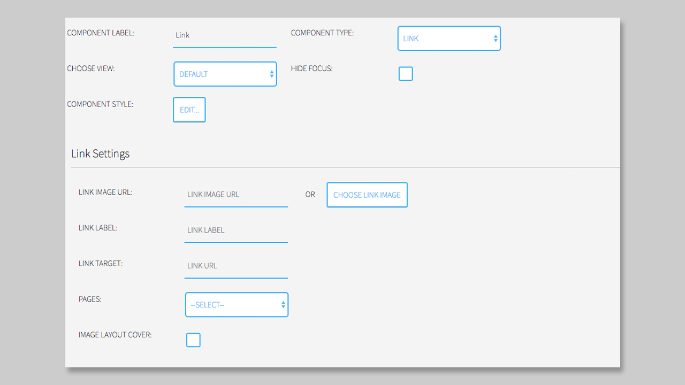

## Link Component

### General

The **Link Component** can be used to add image and/or text links to a page. you can use links to navigate to existing pages, or to other HbbTV applications. A **Link Component** cannot be used color or number keys of the remote control, or control the application (e.g. hide the app). If you want to link to a page or application using the remote controls keys, please use the [Menu Component](https://mpat-eu.github.io/handbook/05_mpat_editing_component_menu.html).

### Settings

You do have different settings coming with the **Link Component**

1. LINK IMAGE URL
2. LINK LABLE
3. LINK TARGET
4. PAGES
5. IMAGE LAYOUT COVER

First you can add a URL to an image or choose the link image from the `Media Library` by clicking on the **CHOSSE LINK IMAGE** button. 

Now you can choose the image you want to add. The selected image will be highlighted and now you can click on the button **Insert into page**, to add it to your box. 

Now the link image is added to your box and the URL is displayed into the Link Image URL section.

If you want to add a label to your link, you can add it via the Link Label section. Just type in your text in the textfield next to it. 
For the Label you can change the style using **COMPONENT STYLE**.

The next step is necessary to link the link to a specific page or application. You can type in the target link into the textfield next to **LINK TARGET** or you can choose a `Page` from the drop down. Here all your current Pages are displayed. When you choose one, the Link Target URL will be changed to the Page URL. 

Another benefit is, that you can also cover the image into the box, if the image is too small for it.

