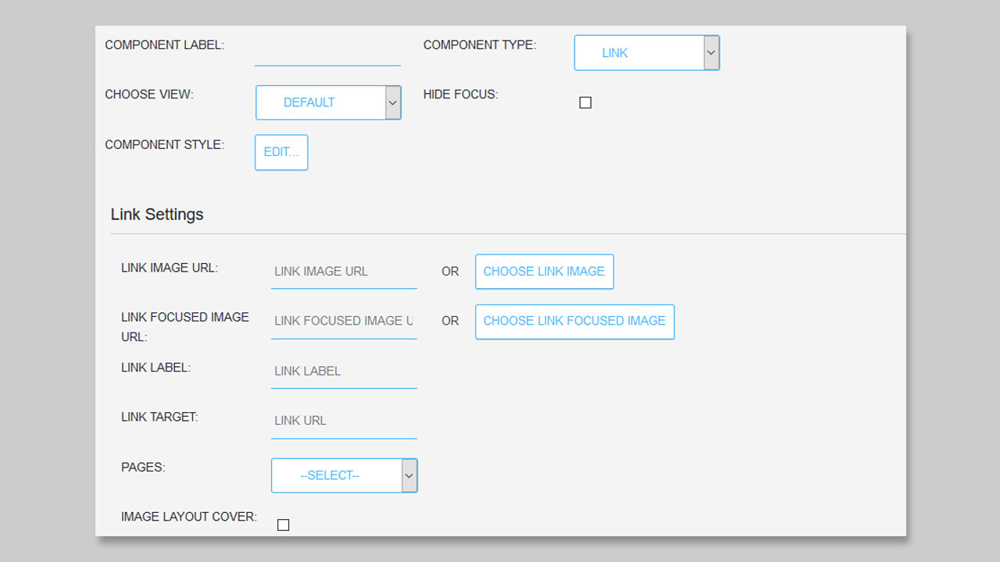
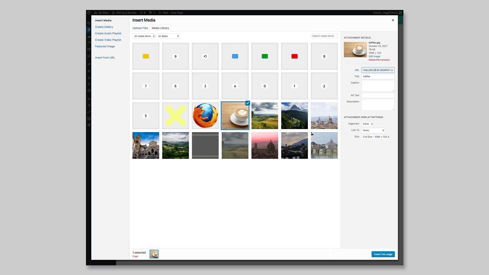

## Link Component

### General

The **Link Component** can be used to add image and/or text links to a page. You can use links to navigate to existing pages or to other HbbTV applications. A **Link Component** cannot be used with colour or number keys of the remote control, or for controlling the application (e.g. hide the app). If you want to link to a page or application using the remote control keys, please use the [Menu Component](https://mpat-eu.github.io/handbook/05_mpat_editing_component_menu.html).

### Settings

You have different settings coming with the **Link Component**

1. LINK IMAGE
2. LINK FOCUSED IMAGE
3. LINK LABEL
4. LINK TARGET
5. PAGES
6. IMAGE LAYOUT COVER

First you can add a URL of an image or choose the link image from the `Media Library` by clicking on the **CHOOSE LINK IMAGE** button. 

Here you can choose the image you want to add. The selected image will be highlighted. Then you click on the button **Insert into page**, to add it to your box. 

Now the link image is added to your box and the URL is displayed in the field 'Link Image URL'.
If you want a different image to appear when the link is "in focus", you can select a **LINK FOCUSED IMAGE** the same way.

If you want to add a label to your link, you can add it via the Link Label section. Just type your text into the textfield next to it. 
For the Label you can change the style using **COMPONENT STYLE**.

The next step is necessary to create the actual link to a specific page or application. You can type the target link into the textfield next to **LINK TARGET** or you can choose a `Page` from the drop-down menu. Here all your current Pages are displayed. If you choose one, the Link Target URL will be changed to the Page URL. 

You can also cover the image into the box, if the image is too small for it.

