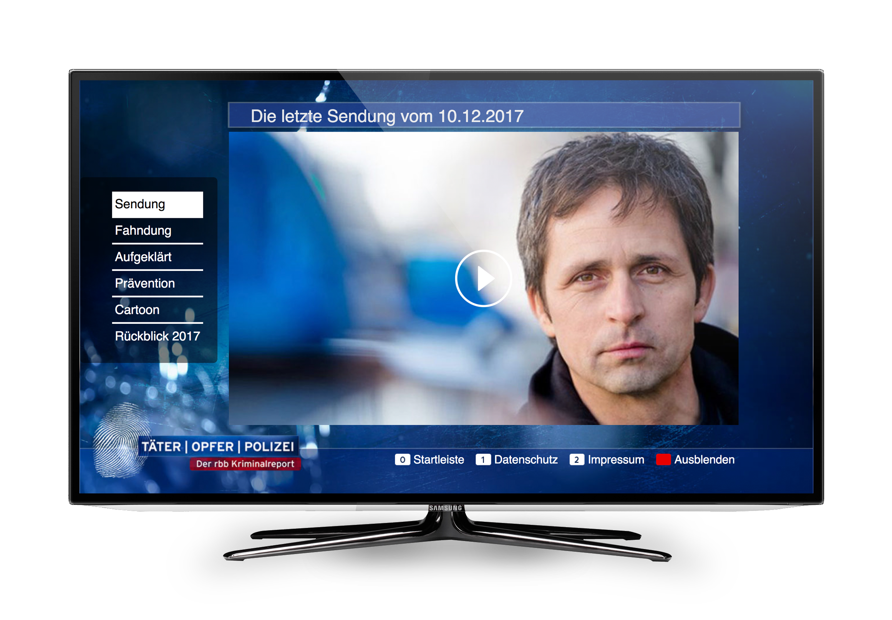
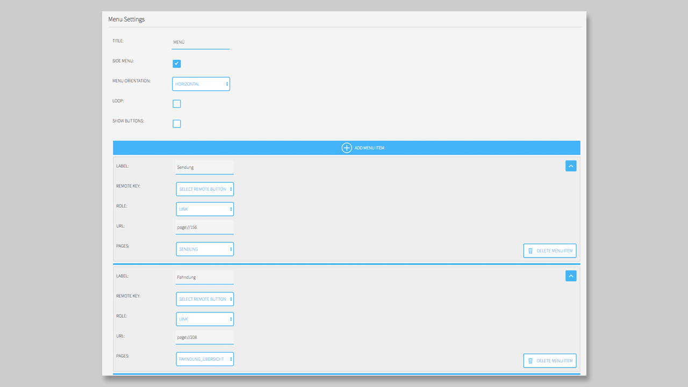

## Menu Component

### General

#### Menu

##### Settings

#### Side Menu

The **Side Menu** contains two different states:

1. active
2. inactive

_Figure 1 - **Side Menu active state** - MPAT Pilot Application Täter, Opfer, Polizei_
git

On the inactive state, you will see a classical **burger menu** icon and a text over it, which you can edit in the settings. 

In the active state, you will see your menu elements in a vertical list. The first element is on the top, the last one on the bottom. 

We used this kind of menu for our **Täter, Opfer, Polizei** Pilot. Here we were playing with two different kind of menus. A **Side Menu** on the middle left area of the app and a classical **Menu** with remote key controlling on the right bottom. 

##### Settings

The settings of the **Side Menu** are pretty close to the general settings of the **Menu**. 

First you have to give your Menu a `Title`. This title will be used in the inactive state. In default mode, it will be `Menu`.

Then you have to activate the `Side Menu` option, otherwise the Menu will be displayed as a normal **Menu**. The next three options (Menu orientation, loop and show buttons) are not interesting for the Side Menu. 

Now you can start to add `Menu Items` to your **Side Menu**.

Like the Menu (or even the [Launcher](https://mpat-eu.github.io/handbook/05_mpat_editing_component_launcher.html)) you can link your Menu to `Pages` of your HbbTV App, use external links or even control the state of another `component` with the **Side Menu Item**. 

Other, then the **Menu**, the remote keys will not be displayed in the **Side Menu**. So, you don't even have to set the `Remote Key` in the settings of the Side Menu. 

Now you can add a new item to your side menu by clicking over or under the existing item. There is a blue line that expands when you are on it. 

If you want to delete the element you have to klick on the button `Delete Menu Item` on the bottom right corner on each element. 

It also helps to toggle the view of the elements by clicking on the top right arrow icon in each element. Here you can minimize the view and only the thumbnail and the Title will be displayed. 

You can also change the order of the elements by drag them into the right position. 

**NOTICE**: It is much easier to drag and drop the elements, when every element is toggled to minimized!
