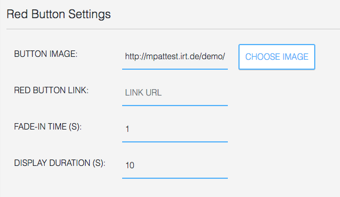

## Red Button Component

### General

The **Red Button Component** is a plain "red button" component, i.e. a symbol that appears shortly
after the page is displayed, triggers another page if the red button is pressed, and disappears 
after some time.

### Settings

Red Button Settings include:

* the image of the button,
* the link of the red button, i.e. the application that is triggered if the red button is pressed,
* the fade-in time, i.e. the time after the page starts to be displayed when the button shall appear,
* the display duration of the red button image

