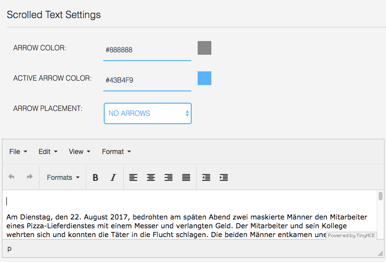

## Scrolled Text Component

### General

The **Scrolled Text Component** will display a longer text including different defined styles. 
These styles can be set globally in the `Customizer`. If you want to change a style for the 
scrolled text component only for a specific box, please use the **COMPONENT STYLE** feature.

The scrolled text component may display arrows up and/or down. If the arrow down (resp. up) is shown, it means 
that there is hidden text below (resp. above) the component.

### Settings

Settings include:

* the color of the arrow
* the active color of the arrow, i.e. the color when text is hidden
* arrow placement: 
  1. on text, left
  1. on text, right
  1. above/below, left
  1. above/below, right
  1. outside, left
  1. outside, right
  1. no arrows (arrows are hidden)

