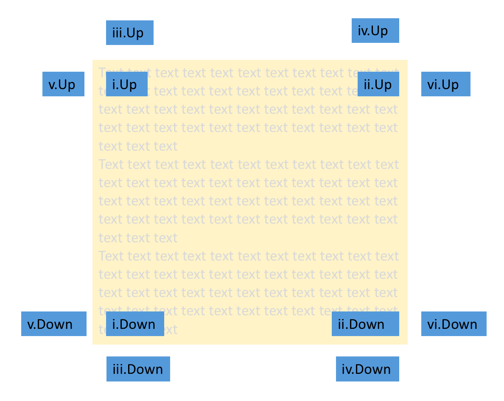
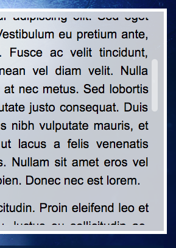

## Scrolled Text Component

### General

The **Scrolled Text Component** will display a longer text including different defined styles. 
These styles can be set globally in the `Customizer`. If you want to change a style for the 
scrolled text component only for a specific box, please use the **COMPONENT STYLE** feature.

The scrolled text component may display arrows up and/or down. If the arrow down (resp. up) is shown, it means 
that there is hidden text below (resp. above) the component.

### Settings

Settings include:

* the color of the arrow
* the active color of the arrow, i.e. the color when text is hidden
* arrow placement: 
  1. on text, left (i.e. inside the rectangle where the text is rendered, on the left)
  1. on text, right (i.e. inside the rectangle where the text is rendered, on the right)
  1. above/below, left (i.e. above/below the rectangle where the text is rendered, on the left)
  1. above/below, right (i.e. above/below the rectangle where the text is rendered, on the right)
  1. outside, left  (i.e. outside the rectangle where the text is rendered, on the left)
  1. outside, right  (i.e. outside the rectangle where the text is rendered, on the right)
  1. no arrows (arrows are hidden)




### Scrollbar

It is possible to have a scrollbar on Scrolled Text components. This may look like the picture below:



The style of the scrollbar is driven by the CSS class `MPATScrolledTextScrollBar` in the `mpat-theme` file `style.css`.

Another CSS class called `MPATScrolledTextWithScrollBar` allows the text not to be overlapped by the scrollbar.

The two classes are by default:

``` css
.MPATScrolledTextScrollBar {
  position: absolute;
  right: 0;
  width: 10px;
  background-color: rgba(255, 255, 255, 0.5);
  border-radius: 5px;
}

.MPATScrolledTextWithScrollBar {
  padding-right: 15px;
}
```

To have scrollbars overlapping the text:

``` css
.MPATScrolledTextScrollBar {
  position: absolute;
  right: 0;
  width: 10px;
  background-color: rgba(255, 255, 255, 0.5);
  border-radius: 5px;
}

.MPATScrolledTextWithScrollBar {
}
```

To remove scrollbars, change `style.css` to:

``` css
.MPATScrolledTextScrollBar {
  background-color: transparent;
}

.MPATScrolledTextWithScrollBar {
}
```
