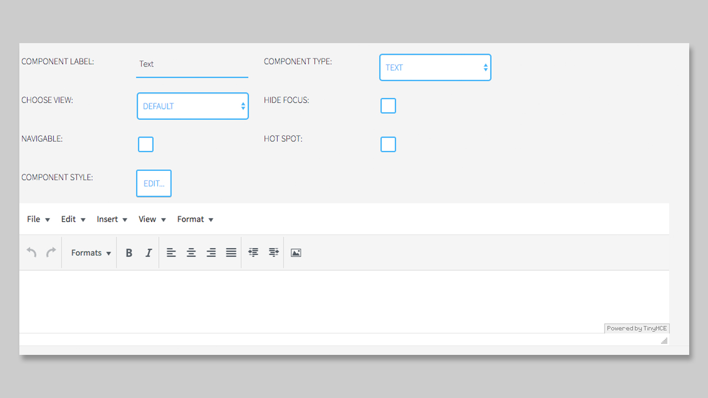
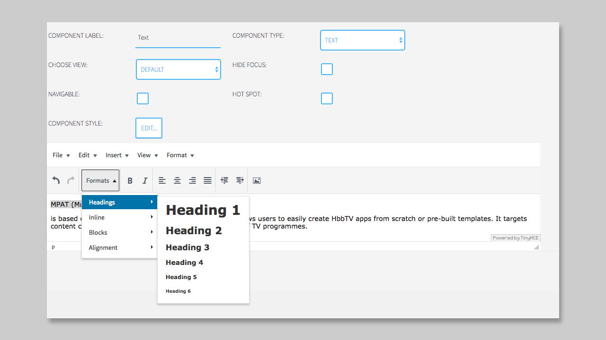

## Text Component

### General

The **Text Component** will display a short text including different defined styles. These styles can be set globally in the `Customizer`. If you want to change a style for the text component only for a specific box, please use the **COMPONENT STYLE** feature.

There is no limit on how many **Text Components** you want to add to a page. If you do have a longer text, that also should be scrollable, please use the [Scrolled Text Component](https://mpat-eu.github.io/handbook/05_mpat_editing_component_scrolled_text.html).

### Settings

The Settings of the **Text Component** are limited to a **What you see is what you get - Editor** (WYSIWYG).
By choosing the **Text Component** from the dropdown the WYSIWYG Editor will open underneath.

Here you can add your short text. If you copy & paste the text from another website, the styles will be also copied into the editor. If you don't want to have these copied styles, please go to **Format --> Clear formatting** to have a clear starting point. 

After you cleared the styles you can start to set Headlines, bold and italic styles.

Also, it is possible to change the alignment of your text with the icons you know from various text editors.
