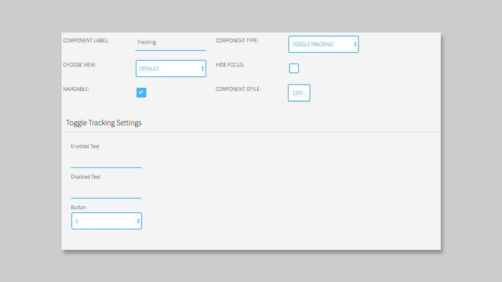

## Toggle Tracking Component

### General

The **Toggle Tracking Component** disables the tracking, that you may setup in the MPAT section. This gives the viewer the opportunity to **Opt Out** of the tracking. If you did not setup tracking in the MPAT section before, the **Toggle Tracking Component** will have no functionality.

### Settings

The Settings of the **Toggle Tracking Component** are very simple. The Component optically acts like the Menu Component](https://mpat-eu.github.io/handbook/05_mpat_editing_component_menu.html) with only one element inside.

You can add a text, that will be displayed, when tracking is enabled, one when it is disabled and then select a remote key button to trigger the action. 

**NOTICE**: When you using a **Menu Component**, please do not use the same remote key for an element, as you are using it for the **Toggle Tracking Component**
