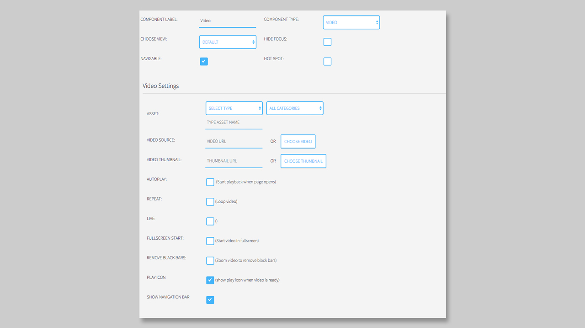

## Video Component

### General

The **Video Component** will display a video in your `Page`. 

Please notice, that you can only display **one** video or broadcast component on a `Page` for HbbTV 1.0 and HbbTV 1.5 applications.

### Settings

The **Player Navigation Bar** or progress bar can be styled in the Customizer globally, or via the Component Settings for only one Box. 

First you have to choose a Video coming from an external URL or from your `Media Library`.

We recommend to use an existing stream, before you upload allot of video content into your MPAT environment.

To use a video and/or a thumbnail image from your Media Library you have to click on the **CHOOSE VIDEO** and/or **CHOOSE THUMBNAIL** button. After clicking on the button, the Media Library will open in a popup.  

Now you can choose the image/video you want to add. The selected image will be highlighted and now you can click on the button **Insert into page**, to add it to your box. 

The Thumbnail will be displayed, when you did not enable the **AUTOPLAY** option below. Also, we are using Thumbnails when the user stops the video. 

####Other Options

#####AUTOPLAY
If you want that your video starts directly when the user is opening the `Page`, then you have to enable **AUTOPLAY** 

#####REPEAT
The video will be looped, after it is on the end. When **REPEAT** is not set, the video will be play to the end and stops then. 

#####LIVE
This option only changes the view of the **NAVIGATION BAR**. If you enable **LIVE**, then you will have the word LIVE instead of a video duration displayed. 

#####FULLSCREEN START
The video will directly start in the fullscreen mode. 

#####REMOVE BLACK BARS
When your box is not in the right format, the **REMOVE BLACK BARS** function will cover the video into the box and removed the black bars. 

#####PLAY ICON
The **PLAY ICON** will be displayed over the **Thumbnail** in the initial state (when autoplay is not enabled).

#####SHOW NAVIGATION BAR
The **Navigation Bar** can also be removed from the player.
