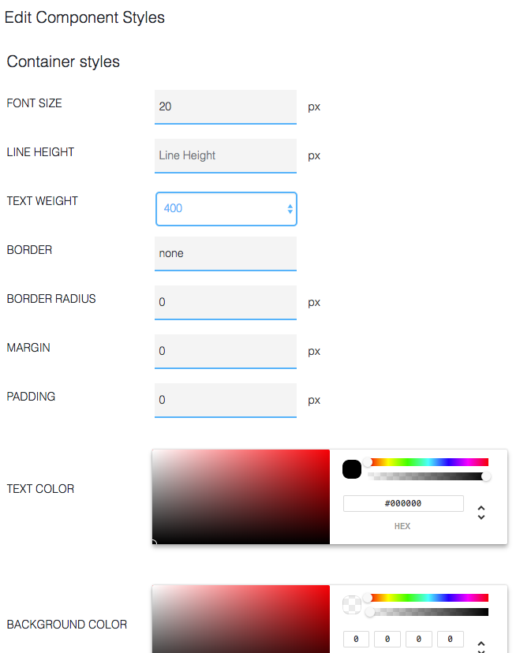
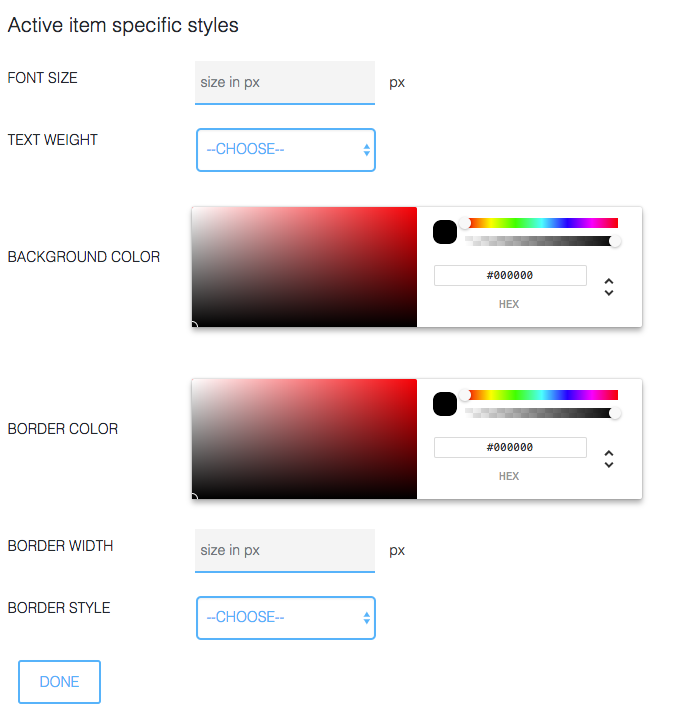

## Tips and Tricks
 
### Save often

As in any editing session – be it in a text document or media editing, etc. – it is highly recommended that you save your changes frequently

### What to consider when creating a SlideFlow Application

- Inside a page the navigation of a gallery must go sideways.
- To avoid long loading, put an introductory page before each video (this only applies if you want the video to load automatically and to play in full screen mode)

### Where is the Focus? Selecting Interactive Elements

In contrast to websites on a PC, you don't navigate with a pointer device (e.g. a mouse) or your fingers on the touchscreen. In an HbbTV application you navigate with the arrow keys of your Remote Control. The point (menu button, component) where you currently are has the Focus. As a visual orientation it is recommended that the active component has a border to give the user some visual orientation. Borders (for active links, etc.) are defined globally under Appearance &gt;&gt; Customize &gt;&gt; Module Settings &gt;&gt; Edit Selected Border Color.

### Edit Component Styles individually

You can define a certain style for any component 
(i.e. border, background color, text color, etc.).  

When relevant, active item styles can be changed:

*Figure 6‑1:* Editing Component Styles

You will find this Component Style Editor in the Content Editor of any Page that you edit.