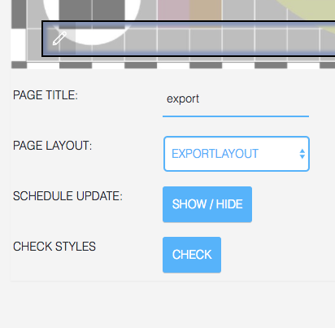
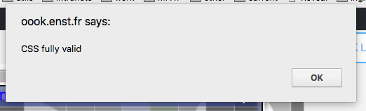
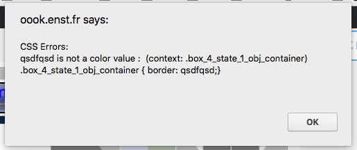

## Troubleshooting

A number of issues will have been mentioned above. In these cases we will refer to the relevant chapter

### I hear the broadcast audio in the background

- The HbbTV standard has no option to automatically mute the broadcast audio. This is especially important, if you preview your application in a browser, because it has no background audio. When testing your application on a TV set, it is recommended to turn on the sound every once in a while, especially for storytelling formats, where the background sounds might be distracting
- One possible way to *mute* the broadcast audio is to add your own audio and activate *autoplay* (see Glossary &gt;&gt; Hotspots), but please be aware that
  - you will have to add an audio file for each page; This new file will play automatically when you open the new page, so there is no way (yet) to have a controlled continuous audio experience
  - If the audio is stopped by starting a new audio (see Glossary &gt;&gt; Hotspots), it will not start again when the new audio ends. The broadcast audio will be audible again.

### The editor does not accept my changes

If you use Firefox both for editing and previewing, you will have to disable FireHbbTV every time you go back to editing.

If you don't the editor may not work properly.

### I have problems with styles

In Page Editor (note: not in the Component Editor), there is a "Check Styles" button.

This Check Styles checks all page- or component-specific styles within the page:

- border specifications in component styles
- additional CSS in the customizer

Other styles are "correct by design": computed styles have been checked statically.   

All these CSS fragments are joined in a CSS file and checked agains the W3C CSS 
validator service. Errors are signalled one by one in a dialog.

