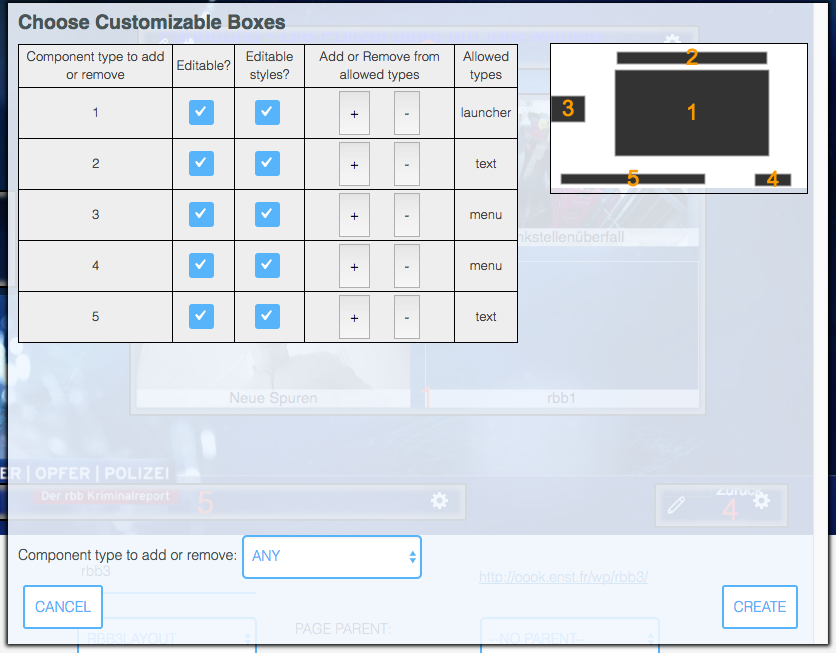
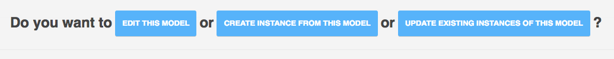

# Page Models

Page Models are templates for partially editable pages.

## How to create a Page Model

Page Models are created from MPAT Pages. Choose a Page that you want to use as a template.
Then choose which of the boxes in the page can be edited and which should stay constant.
Among the editable boxes, choose if the box can host any type of component, or one type 
of component, or a list of types; choose also if the styling of the component can be 
changed. 

Once you have decided all this, press the button "Create Model from Page", and in the popup
answer the questions:

* which box can be edited
* which box can be styled
* what are the allowed types for each editable box

When you are finished, in the popup, press "Create".
A new Page Model with the name of the Page suffixed with "_pm" is created.

The Page Model created from a Page takes a copy of the Page at the time of its creation.
If you modify the original Page, the Page Model is not changed.

## How to use a Page Model to create a Page Model instance

Go to the Page Models overview. Choose a Page Model and click on it.
You get one choice.

If you click on the right button, you get to create a Page Model Instance.

A Page Model Instance is a copy of the Page Model at that moment. If you modify the 
Page Model after this, the Page Model instance is unchanged.

A Page Model instance is edited in the same editor as Pages. The only differences
are that any box that is not editable in the Page Model is not accessible inthe editor.
The editor does not show the button to edit it.

Editable boxes and styles use the exact same interface as for pages.

When you save the Page Model Instance for the first time, a dialog appears to let
you choose the name of the instance. After being saved with a new name, the new 
Page Model Instance appears with the Pages in the Pages Overview. 

In the Page Editor, you can see if a page is a Page Model Instance or a plain Page by
the presence of the "Create Model from Page" button in Pages, or the indication
"Page created from Page Model <pageModelName>" in the lower left.

## How to edit a Page Model

Go to the Page Models overview. Choose a Page Model and click on it.
You get the choice above.

If you click on the left button, you get to edit the Page Model itself.

A Page Model can be edited with the same interface as a Page.

When you edit a Page Model and save it, neither the original Page nor any of the Page
Model instances created from this Page Model are modified.
