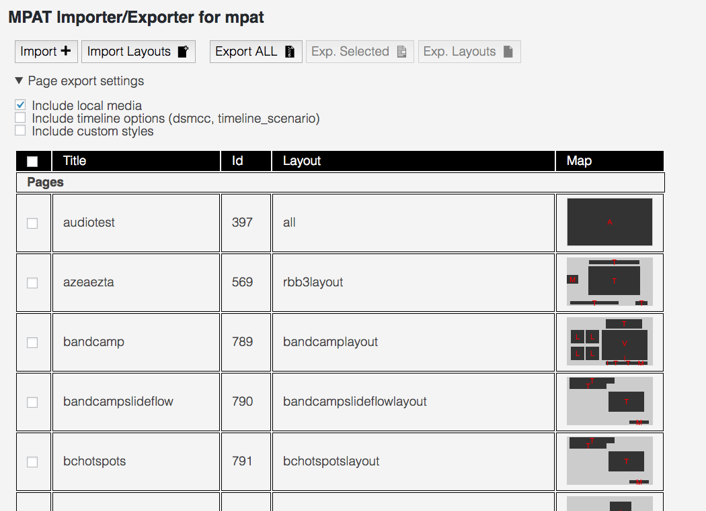

#Using the Import Export plugin

The Import Export plugin is accessible in the left side bar from this icon:

The typical aspect of the MPAT Importer/Exporter page is this:

##Exported packages

Exported packages are JSON text files containing one or more Pages and/or Page Layouts,
possibly with their media. As a result, these can be quite large.

Exported packages are typically files with extension .mpat-page

##Export

You can choose what to export:

* All pages and layouts with media: just press Export ALL with the default options
* Check or uncheck options to include local media, timeline info and custom styles
* Select single or multiple pages by clicking the checkbox in the first colum of the table. 

If media are not exported, links to the current MPAT instance are kept. If the current
MPAT instance is a private one, the export package will not work.

##Import

If you click Import, you get to choose a file. This file should be an exported package.

If a page or a layout of the same name already exists in the current site, 
the page or layout in the imported package will be ignored.

